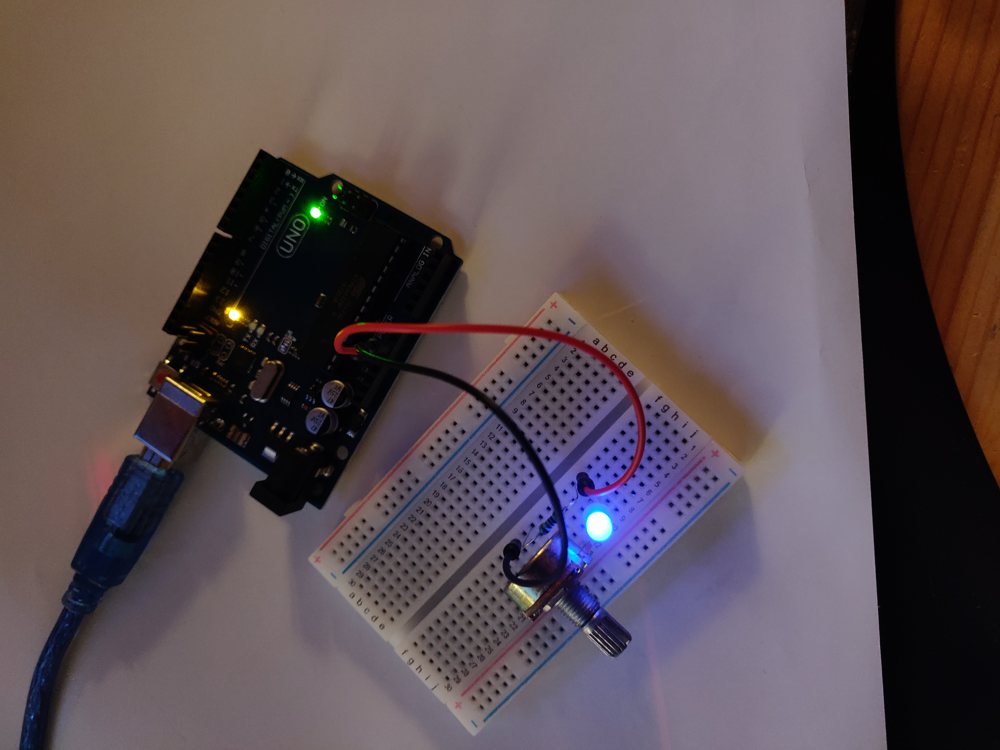
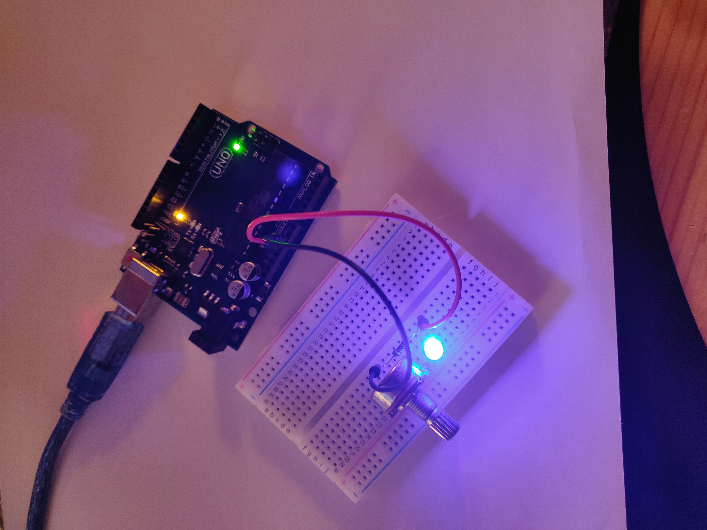

# Lab 1 report

## Exercise 1

The first method uses a variable resistance to directly drive the led brightness.
It is an analog method. It isn't very good because the LED can shut down if the resistance voltage drop is too big.

Whereas the digital solution (using a micro controller) always output 0V or 5V but the width of the impulsion is proportionnal to the resistor's value. It is better to use this solution.

